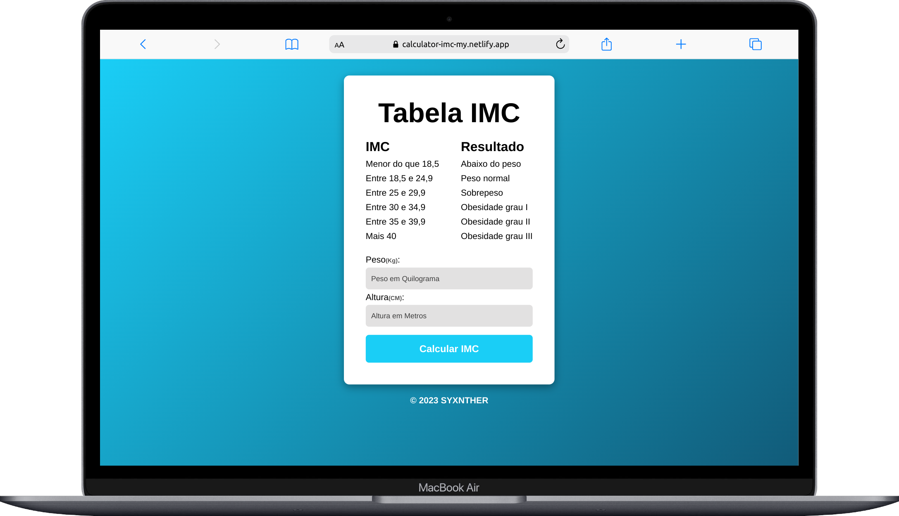
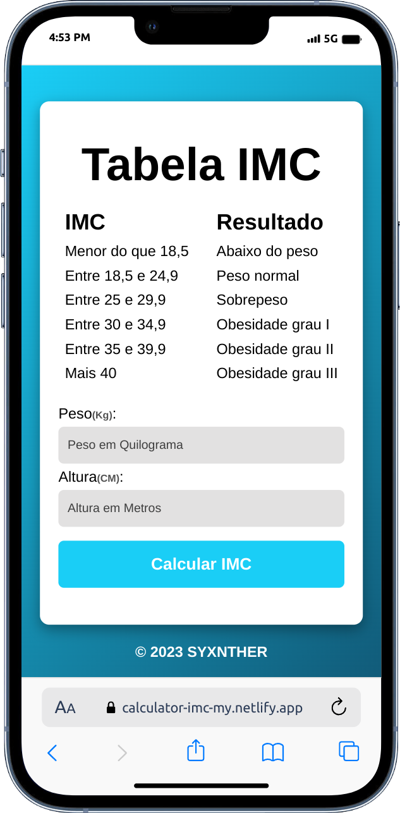

# Calculadora IMC:

Projeto feito em javascript, com manipulação de DOM.

A calculadora efetua o calculo de IMC a partir do peso e altura do usuário.

## Desktop and mobile version:

## Link:

<a href="https://calculator-imc-my.netlify.app/" target="_blank">Go project</a>